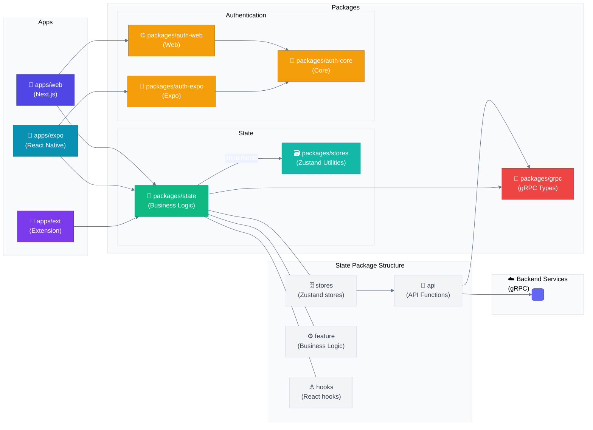

# 🏗️ Prio Frontend Architecture

This document explains the Prio frontend architecture, including the project structure, state management, and best practices for developers.

## 📊 Architecture Diagram



## 📁 Project Structure

Our frontend follows a monorepo architecture with multiple applications and shared packages:

### 📱 Apps

| App      | Description                                   |
| -------- | --------------------------------------------- |
| **web**  | Main web application based on Next.js         |
| **expo** | Mobile application based on React Native/Expo |
| **ext**  | Browser extension                             |

### 📦 Packages (Shared packages)

| Package       | Description                                               |
| ------------- | --------------------------------------------------------- |
| **state**     | Application state management and business logic           |
| **stores**    | Utilities for creating Zustand stores                     |
| **grpc**      | gRPC client and generated types for backend communication |
| **auth-core** | Core authentication logic                                 |
| **auth-web**  | Web authentication implementation                         |
| **auth-expo** | Mobile authentication implementation                      |

## ⚠️ Critical Architecture Considerations

### 🧩 Shared Components

- Common components should be placed in shared locations
- Identical components used in multiple places should be extracted and reused
- Consider creating a component library for frequently used patterns

**Example of component reuse:**

```typescript
// ❌ WRONG: Duplicating component logic in multiple places
function UserProfilePage() {
  return (
    <div>
      <div className="rounded-lg shadow p-4 bg-white">
        <h2 className="text-xl font-bold">User Info</h2>
        <div className="mt-2 space-y-2">{/* Profile content */}</div>
      </div>
    </div>
  );
}

function TeamPage() {
  return (
    <div>
      <div className="rounded-lg shadow p-4 bg-white">
        <h2 className="text-xl font-bold">Team Info</h2>
        <div className="mt-2 space-y-2">{/* Team content */}</div>
      </div>
    </div>
  );
}

// ✅ CORRECT: Extract common UI patterns into reusable components
function Card({ title, children }) {
  return (
    <div className="rounded-lg shadow p-4 bg-white">
      <h2 className="text-xl font-bold">{title}</h2>
      <div className="mt-2 space-y-2">{children}</div>
    </div>
  );
}

function UserProfilePage() {
  return <Card title="User Info">{/* Profile content */}</Card>;
}

function TeamPage() {
  return <Card title="Team Info">{/* Team content */}</Card>;
}
```

#### Why do we use a monorepo architecture?

- It allows sharing code between web, mobile and extension applications
- Simplifies dependency management and version synchronization
- Makes it easier to refactor code that affects multiple applications
- Enables consistent patterns and practices across applications
- Facilitates team collaboration and knowledge sharing

#### What is the role of each package in the architecture?

- **state**: Application state management and business logic
- **stores**: Reusable utilities for creating Zustand stores
- **grpc**: Client and generated types for backend communication
- **auth-core**: Core authentication logic shared across platforms
- **auth-web**: Web-specific authentication implementation
- **auth-expo**: Mobile-specific authentication implementation

#### Why do we have separate state and stores packages?

We separate the code into different packages by responsibilities:

- **packages/stores**:

  - Contains generic reusable utilities for creating Zustand stores
  - Does not contain application-specific business logic
  - Provides patterns like `createGrpcSingleMethodStore` and `createGrpcOptimisticStore`

- **packages/state**:
  - Implements application-specific business logic
  - Uses the utilities from `packages/stores` to create concrete stores
  - Organizes stores by domain (activities, agent, collection, etc.)
  - Implements selectors, transformers, and business logic

#### Why don't we import gRPC directly in web/expo?

- **NEVER** import `@mono-grpc` or any gRPC-related objects directly in app components
- Always use the abstracted state layer through `@mono-state` hooks

For several important reasons:

- **Separation of Concerns**:

  - Applications focus on user experience and presentation
  - Backend communication is abstracted in the state package

- **Code Reuse**:

  - Backend communication logic is implemented once in the state package
  - All applications can use the same implementation

- **Testing Simplicity**:

  - It's easier to test business logic independently from the UI
  - We can create mocks for gRPC clients in state tests

- **Flexibility for Changes**:
  - If we need to change the communication technology (e.g., from gRPC to REST)
  - We would only need to update the state package, not the applications

### State Management

#### What is the best practice for accessing Zustand stores in React components?

```typescript
// ❌ WRONG: Instantiating store inside component
function MyComponent() {
  // This creates a new store instance every time!
  const store = createMyStore();

  return <div>{store.getData()}</div>;
}

// ❌ WRONG: Each component accessing the store separately
// Parent component
function BadParentComponent() {
  // First store initialization
  const { items } = useMyStore();

  return (
    <div>
      <h1>Items ({items.length})</h1>
      <BadItemsList />
      <BadItemActions />
    </div>
  );
}

// Child also initializes store independently
function Items() {
  // Second store initialization - creates disconnected state!
  const { items, loading } = useMyStore();

  if (loading) return <div>Loading...</div>;
  return (
    <ul>
      {items.map((item) => (
        <li key={item.id}>{item.name}</li>
      ))}
    </ul>
  );
}

// Another child also initializes store independently
function BadItemActions() {
  // Third store initialization - creates another disconnected state!
  const { addItem, removeItem } = useMyStore();

  return (
    <div>
      <button onClick={() => addItem("New Item")}>Add</button>
      <button onClick={() => removeItem(1)}>Remove First</button>
    </div>
  );
}

// ⚠️ IMPORTANT: The above pattern is problematic because:
// 1. It creates unnecessary re-renders when the store updates
// 2. Each component depends directly on the store, making them less reusable
// 3. It creates separate data for each store, losing consistency across the UI
// 3. Testing becomes more difficult as components are tightly coupled to the store
// 4. Component relationships and data flow are less clear
// 5. Code becomes less maintainable as the application grows
//
// The best practice is to centralize store access in parent components and pass data down as props.

// ✅ BEST PRACTICE: Initialize in parent, propagate to children
// Parent component
function ParentComponent() {
  // Access store data once at the parent level
  const { items, loading, error, addItem, removeItem } = useMyStore();

  // Pass only what children need
  return (
    <div>
      <ItemsList items={items} loading={loading} />
      <ItemActions onAdd={addItem} onRemove={removeItem} />
    </div>
  );
}

// Child components only receive what they need
function ItemsList({ items, loading }) {
  if (loading) return <div>Loading...</div>;
  return (
    <ul>
      {items.map((item) => (
        <li key={item.id}>{item.name}</li>
      ))}
    </ul>
  );
}

function ItemActions({ onAdd, onRemove }) {
  return (
    <div>
      <button onClick={() => onAdd("New Item")}>Add</button>
      <button onClick={() => onRemove(1)}>Remove First</button>
    </div>
  );
}
```

#### Where should business logic be placed in the architecture?

- Business logic belongs in state package, not in UI components
- Conditional logic for API calls should be in state stores

**Example of proper logic placement:**

```typescript
// ❌ WRONG: Implement logic in UI
function CreateCollectionButton() {
  const { createCollection } = useCollectionStore();

  const handleClick = () => {
    if (eventId) {
      createCollectionWithEvent("My Collection", "Description", eventId);
    } else {
      createCollection("My Collection", "Description");
    }
  };

  return <Button onClick={handleClick}>Create</Button>;
}

// ✅ CORRECT: Logic in the state store
// In collection store
export const useCollectionStore = create((set) => ({
  // ...other store properties
  createCollection: async (name, description, eventId) => {
    if (eventId) {
      // If we have an eventId, use the createCollectionWithEvent method
      await createCollectionWithEvent(name.trim(), eventId, {
        description: description.trim(),
      });
    } else {
      // Otherwise just create a new collection
      await createNewCollection(name.trim(), {
        description: description.trim(),
      });
    }
  },
}));

// In UI component - clean and simple
function CreateCollectionButton() {
  const { createCollection } = useCollectionStore();

  const handleClick = () => {
    createCollection("My Collection", "Description", eventId);
  };

  return <Button onClick={handleClick}>Create</Button>;
}
```

#### When and why should I consider splitting Zustand stores?

- When working with complex stores, consider splitting read/write operations
- Use local caching strategies for frequently accessed data
- Create specialized hooks that expose only relevant parts of the store

#### TODO: Stores builders use cases
